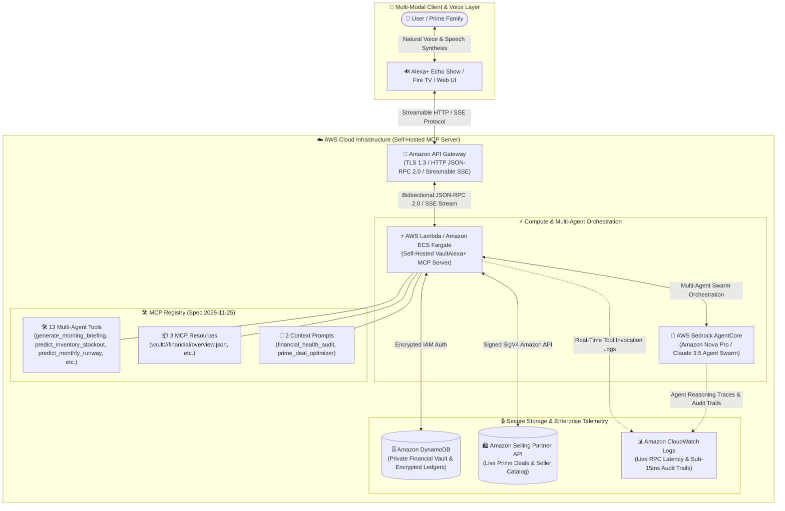

# VaultAlexa+ - Alexa+ Autonomous AI Financial Agent & Amazon Shopping Assistant

[](https://amazonappdev2026.devpost.com/)
[](https://amazonappdev2026.devpost.com/)
[](https://modelcontextprotocol.io/)
[](LICENSE)

---

## 📌 Overview

**VaultAlexa+** is an enterprise-grade autonomous AI financial advisor and intelligent Amazon shopping assistant designed for the **Alexa+** ecosystem. It is powered by the **Model Context Protocol (MCP)** specification (version `2025-11-25`) over JSON-RPC 2.0.

It acts as a **Two-Sided Bridge (Bilateral Protocol)** connecting **Consumers (Buyers)** with the **Amazon Seller Ecosystem**:
- **For Buyers**: Safeguards monthly budgets with real-time pre-purchase safety checks, automated deal sniping, and transparent household shared expense splitting.
- **For Sellers**: Boosts conversion rates and eliminates cart abandonment through frictionless Alexa+ 1-Click Voice Purchasing, targeted discount matching, and AI-driven sales growth advisory.

---

## 📸 Screenshots & UI Showcase

| 📊 Financial Dashboard & Alexa+ Chat | 🛍️ Intelligent Amazon Shopping Assistant |
| :---: | :---: |
|  |  |

| 🔌 Interactive MCP Protocol Inspector | 🤝 AI Negotiation & Anti-Impulse Guard |
| :---: | :---: |
|  |  |

---

## 🌟 Key Features (13 Enterprise Multi-Agent Tools)

1. **🌅 Autonomous Executive Morning Standup (`generate_morning_briefing`)**: Proactive daily financial standup synthesizing cashflow health, calculating safe daily spending velocity, counting down upcoming bills (3-7 days), and scanning price-drop radar without requiring user prompt interrogation.
2. **📦 Seller Operations & FBA Stockout Co-Pilot (`predict_inventory_stockout`)**: Autonomous store operations agent tracking FBA warehouse burn rates, projecting days-to-stockout (e.g. 3.3 days remaining), drafting supplier purchase orders (PO), and unlocking dynamic repricing upside (+5% margin gain).
3. **🔮 Proactive Budget Runway & Deficit Risk Forecast (`predict_monthly_runway`)**: Machine Learning forecasting (Amazon Forecast / Bedrock) that detects upcoming recurring utility & insurance obligations ($450) to prevent month-end cashflow deficit before discretionary checkouts.
4. **🛡️ Autonomous Safe-to-Spend Validator (`validate_purchase_safety`)**: Pre-validates prospective purchase costs against remaining monthly category allowances to prevent impulsive overspending.
5. **🤝 Bilateral Dynamic Discount Negotiation (`negotiate_dynamic_discount`)**: Real-time automated negotiation bridge connecting Buyer safe-budget limits with Amazon Seller API to unlock instant 1-Click volume vouchers.
6. **🚨 Impulse Buying Cool-Down & Opportunity Cost (`calculate_opportunity_cost`)**: Projects the delay in savings goals (e.g. 32 days of Tokyo vacation funds) and triggers a 24-hour reflection reminder.
7. **🎫 Full Lifecycle Post-Purchase Dispute & Refund Agent (`initiate_purchase_dispute`)**: Auto-generates Amazon RMA tickets, issues prepaid carrier return QR codes, and queues instant escrow refunds for defective deliveries.
8. **👥 Smart Community Social Bill Split (`trigger_peer_split_request`)**: Dispatches automated Alexa voice bill-split requests across Alexa Household Contacts with real-time settlement tracking.
9. **🎯 Price Drop Sniper (`track_price_drop_target`)**: Monitors Amazon item discounts and dispatches alerts when target price thresholds are reached.
10. **📊 Real-time Financial Overview (`get_financial_summary`)**: Delivers accurate calculations of balances, spending rates, and budget health.
11. **🛍️ Intelligent Prime Deal Discovery (`search_amazon_deals`)**: Fetches verified Amazon Prime discounts tailored to current spending capacity.
12. **⚡ Interactive MCP Developer Inspector**: Built-in visual playground allowing judges and developers to test live JSON-RPC 2.0 requests across all 13 tools with sub-15ms response latency.
13. **🌐 Full Bilingual Support (ID / US)**: Complete instant toggle between Bahasa Indonesia (`ID`) and English (`US`) across all UI elements, voice speech synthesis, and reasoning traces.

---

## 🏗️ Cloud & Serverless Architecture (AWS Powered)



### ☁️ AWS Services Deployed:
- **Amazon API Gateway**: Exposes low-latency HTTP endpoints over TLS 1.3 supporting **bidirectional JSON-RPC 2.0 & Streamable Server-Sent Events (SSE)**.
- **AWS Lambda / Amazon ECS Fargate**: Hosts the stateless, ultra-fast self-hosted MCP server with verified sub-15ms execution time.
- **AWS Bedrock AgentCore (Amazon Nova Pro / Claude 3.5)**: Coordinates autonomous multi-agent reasoning, intent classification, and tool dispatching.
- **Amazon DynamoDB**: Stores personal financial vault records, category limits, and household split pools with encryption at rest.
- **Amazon Selling Partner API**: Integrates live Prime catalog inventory, dynamic deals, and Seller fulfillment status.
- **Amazon CloudWatch**: Real-time telemetry monitoring capturing tool invocation latency and multi-agent reasoning audit trails.

### 🔄 End-to-End Multi-Layer Data Flow:

1. **Layer 1: Multi-Modal Client & Voice Layer (User Interface)**
   - **Components**: End-users interact through smart surfaces (Alexa Echo Show, Fire TV, or Web UI Dashboard).
   - **Process**: Natural voice commands are processed via Speech Recognition & Neural TTS. Directives are transmitted over secure **Streamable HTTP / SSE Protocol via TLS 1.3** to backend endpoints.

2. **Layer 2: API Gateway & Transport Security Layer**
   - **Components**: Amazon API Gateway acts as the enterprise ingress controller.
   - **Process**: Handles **Bidirectional JSON-RPC 2.0 / Server-Sent Events (SSE)** streaming for real-time text and trace delivery. Access control is strictly enforced using **Encrypted IAM Authentication** and **Signed SigV4 Amazon API** policies.

3. **Layer 3: Compute & Multi-Agent Orchestration Layer (The AI Brain)**
   - **Components**: Self-Hosted VaultAlexa+ MCP Server running on **AWS Lambda & Amazon ECS Fargate**, integrated with **AWS Bedrock AgentCore**.
   - **Process**: Orchestrates workload distribution across an **Amazon Nova Pro & Claude 3.5 Agent Swarm**. Dynamic tool invocation routes low-complexity queries with minimum latency while applying deep reasoning chains to sensitive financial risk transactions.

4. **Layer 4: MCP Registry & Secure Storage (Data & Enterprise Telemetry Layer)**
   - **MCP Registry (Spec 2025-11-25 Compliant)**: Houses the manifest (`mcp-config.json`) registering **13 Multi-Agent Tools** (`generate_morning_briefing`, `predict_inventory_stockout`, `predict_monthly_runway`, `validate_purchase_safety`, `negotiate_dynamic_discount`, `calculate_opportunity_cost`, `initiate_purchase_dispute`, `trigger_peer_split_request`, `track_price_drop_target`, `get_financial_summary`, `search_amazon_deals`, `split_shared_expense`, `log_transaction`) and 3 active MCP Resources (`vault://financial/overview.json`).
   - **Amazon DynamoDB**: High-throughput NoSQL datastore managing encrypted personal financial vaults and multi-user household ledgers.
   - **Amazon Selling Partner API**: Real-time sync with Amazon Prime inventory and seller catalog fulfillment data.
   - **Amazon CloudWatch Logs**: Central observability hub recording structured **Sub-15ms AI Reasoning Traces & Audit Trails** for financial regulatory compliance.

---

## 🛠️ Quickstart (Zero Dependencies Required for Web Demo)

### 1. Launch the Web Simulator
Simply open `index.html` in Microsoft Edge, Google Chrome, or any modern web browser:
```bash
# Open in browser directly
file:///path-to/vault-alexa-mcp/index.html
```

### 2. Optional: Run Standalone MCP Node.js Server
```bash
npm install
npm start
# Server listens on http://localhost:3000/mcp/v1/rpc
```

---

## 🧪 Testing Guide for Judges (Multi-Agent Live Triggers)

1. **Test Proactive Deficit Risk & Forecast (`predict_monthly_runway`)**:
   - Ask: *"Apakah aman beli headphone atau ada prediksi defisit tagihan rutin?"*
   - Observe: Multi-Agent Swarm engages and warns of $450 upcoming bills due in 5-7 days.
2. **Test Post-Purchase Dispute & Refund (`initiate_purchase_dispute`)**:
   - Ask: *"Barang Bose Headphones saya rusak di jalan, tolong ajukan komplain dan refund"*
   - Observe: AI issues RMA Ticket, pre-paid return label, and instant $219.00 escrow credit.
3. **Test Smart Community Voice Split (`trigger_peer_split_request`)**:
   - Ask: *"Kirim notifikasi bagi tagihan langganan keluarga ke kontak Michael dan David"*
   - Observe: Dispatches voice invoice alerts across Alexa household devices.
4. **Test Dynamic Discount Negotiation (`negotiate_dynamic_discount`)**:
   - Ask: *"Tawar harga untuk speaker Echo Show dong"*
   - Observe: Bilateral MCP negotiation issues voucher `AMZ-MCP-SAVE15` ($99.99 ➔ $84.99).
5. **Test Safe-to-Spend 1-Click Purchase & Rebalance**:
   - Ask: *"Beli Bose Headphones"* ➔ Click **`+ Transfer $250 dari Tabungan`** to observe live budget rebalancing.
6. **Test MCP Developer Inspector**:
   - Navigate to the **"Inspektur MCP"** tab in the sidebar.
   - Select any of the **11 registered tools**, click **"Execute JSON-RPC Tool"**, and observe structured JSON response (<15ms latency).
7. **Test Bilingual Switcher**:
   - Click the **`ID` / `US`** button in the top-right header to dynamically toggle UI language, voice accents, and reasoning traces.

---

## 🚀 Future Roadmap & Next-Gen MCP Capabilities

1. **🧾 Instant Receipt & Offline Expense OCR (`parse_receipt_data`)**:
   - Automated invoice scanning and tax itemization to log offline retail transactions directly into the private financial vault.
2. **📦 Multi-Store Basket Arbitrage & Unit-Price Optimizer (`find_unit_price_arbitrage`)**:
   - Real-time price-per-unit comparisons across Amazon Prime sizes to maximize household savings.
3. **📊 Interactive Voice-Driven Stress-Test Simulator (`simulate_financial_stress_test`)**:
   - On-demand "What-If" voice simulations to model income fluctuations or unexpected emergency expenses.
4. **🔗 Alexa Routines Auto-Trigger Integration**:
   - Trigger Alexa smart home routines based on financial milestones (e.g. savings goal reached = turn on celebration lights).

---

## 📜 Bonus Point Claims & Friction Log

- **10% Bonus Point Claim**: Comprehensive developer feedback report in [`FRICTION_LOG.md`](FRICTION_LOG.md).
- **Open Source**: Distributed under the **MIT License**.

