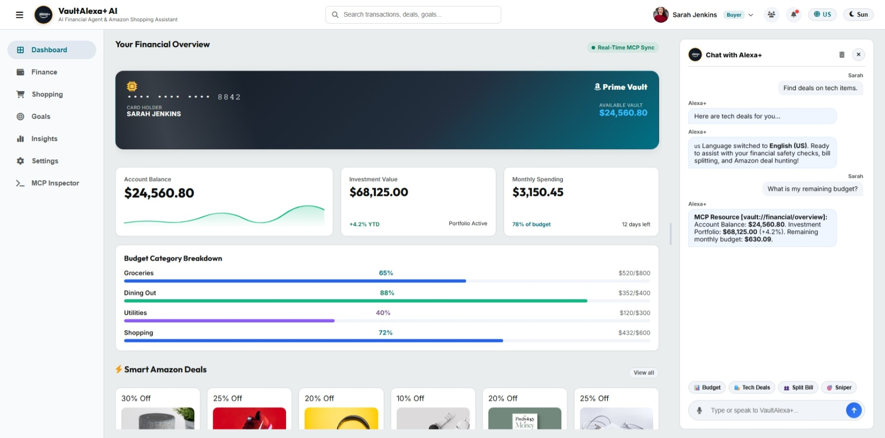
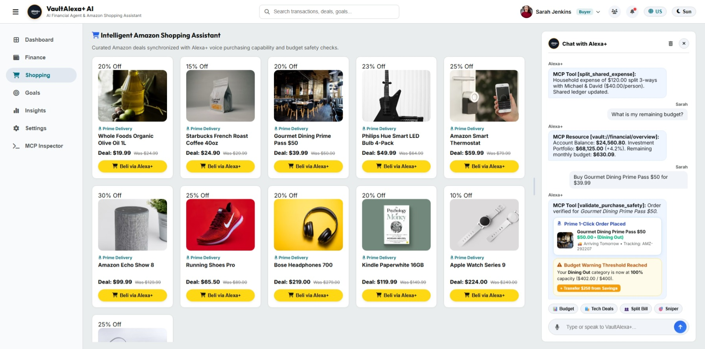
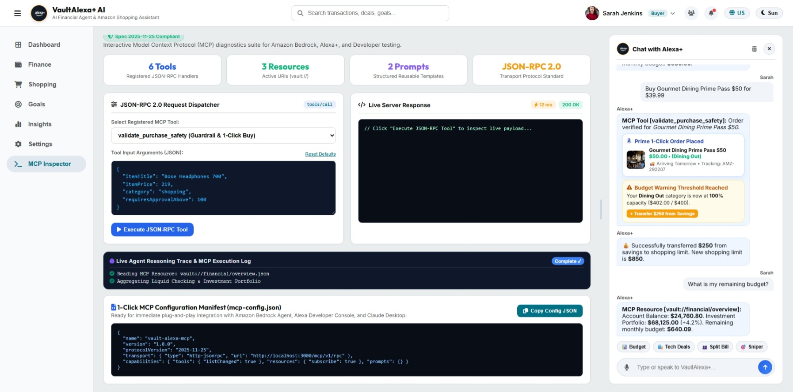
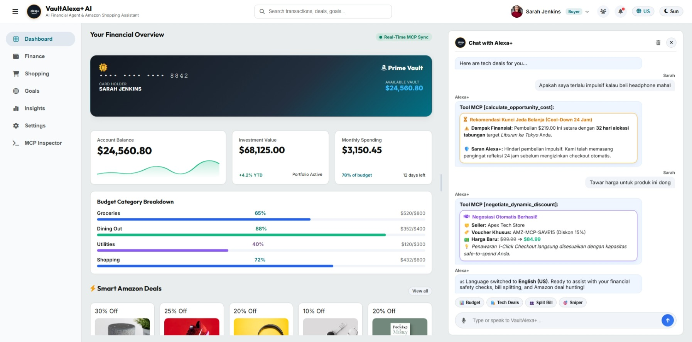
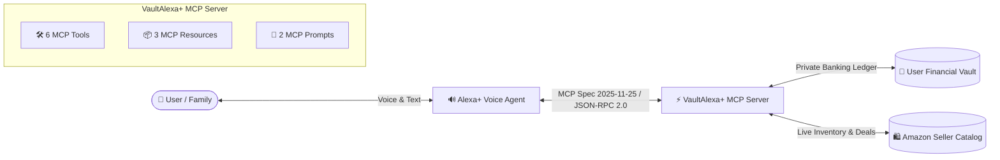

# VaultAlexa+ - Alexa+ Autonomous AI Financial Agent & Amazon Shopping Assistant

[](https://amazonappdev2026.devpost.com/)
[](https://amazonappdev2026.devpost.com/)
[](https://modelcontextprotocol.io/)
[](LICENSE)

---

## 📌 Overview

**VaultAlexa+** is an enterprise-grade autonomous AI financial advisor and intelligent Amazon shopping assistant designed for the **Alexa+** ecosystem. It is powered by the **Model Context Protocol (MCP)** specification (version `2025-11-25`) over JSON-RPC 2.0.

It acts as a **Two-Sided Bridge (Bilateral Protocol)** connecting **Consumers (Buyers)** with the **Amazon Seller Ecosystem**:
- **For Buyers**: Safeguards monthly budgets with real-time pre-purchase safety checks, automated deal sniping, and transparent household shared expense splitting.
- **For Sellers**: Boosts conversion rates and eliminates cart abandonment through frictionless Alexa+ 1-Click Voice Purchasing, targeted discount matching, and AI-driven sales growth advisory.

---

## 📸 Screenshots & UI Showcase

| 📊 Financial Dashboard & Alexa+ Chat | 🛍️ Intelligent Amazon Shopping Assistant |
| :---: | :---: |
|  |  |

| 🔌 Interactive MCP Protocol Inspector | 🤝 AI Negotiation & Anti-Impulse Guard |
| :---: | :---: |
|  |  |

---

## 🌟 Key Features

1. **Autonomous Safe-to-Spend Validator (`validate_purchase_safety`)**: Pre-validates prospective purchase costs against remaining monthly category allowances to prevent impulsive overspending.
2. **Price Drop Sniper (`track_price_drop_target`)**: Monitors Amazon item discounts and dispatches alerts when target price thresholds are reached.
3. **Household Split Ledger (`split_shared_expense`)**: Manages multi-user family expenses and shared budget pools across Amazon Household members.
4. **Intelligent Deal Discovery (`search_amazon_deals`)**: Fetches verified Amazon Prime discounts tailored to current spending capacity.
5. **Real-time Financial Overview (`get_financial_summary`)**: Delivers accurate calculations of balances, spending rates, and budget health.
6. **Expense Logging (`log_transaction`)**: Directly registers new ledger items and updates category analytics in real time.
7. **Interactive MCP Developer Inspector**: Built-in visual playground allowing judges and developers to test live JSON-RPC 2.0 requests and inspect sub-15ms response latency.
8. **1-Click MCP Manifest (`mcp-config.json`)**: Ready for plug-and-play connection with Amazon Bedrock Agent, Alexa Developer Console, and Claude Desktop.
9. **Full Bilingual Support (ID / US)**: Complete instant toggle between Bahasa Indonesia (`ID`) and English (`US`) across all UI elements, voice speech synthesis, and reasoning traces.

---

## 🏗️ Architecture



---

## 🛠️ Quickstart (Zero Dependencies Required for Web Demo)

### 1. Launch the Web Simulator
Simply open `index.html` in Microsoft Edge, Google Chrome, or any modern web browser:
```bash
# Open in browser directly
file:///path-to/vault-alexa-mcp/index.html
```

### 2. Optional: Run Standalone MCP Node.js Server
```bash
npm install
npm start
# Server listens on http://localhost:3000/mcp/v1/rpc
```

---

## 🧪 Testing Guide for Judges

1. **Test Autonomous AI Reasoning**:
   - In the chat panel, click **📊 Sisa Anggaran** or ask *"Berapa sisa uang belanja minggu ini?"*.
   - Ask *"Beli Running Shoes"* to inspect the autonomous `validate_purchase_safety` flow with 1-Click order confirmation.
   - Ask *"Bagaimana cara meningkatkan penjualan produk seller?"* to test the Seller Growth Advisor.
2. **Test MCP Developer Inspector**:
   - Navigate to the **"Inspektur MCP"** tab in the sidebar.
   - Select any tool (e.g. `validate_purchase_safety`), click **"Execute JSON-RPC Tool"**, and observe the structured JSON response (~8-12 ms latency).
   - Click **"Copy Config JSON"** to export the manifest.
3. **Test Bilingual Switcher**:
   - Click the **`ID` / `US`** button in the top-right header to dynamically toggle all UI text, voice synthesis accents, and agent reasoning.

---

## 🚀 Future Roadmap & Next-Gen MCP Capabilities

1. **🤖 Autonomous Deal Negotiation Protocol (`negotiate_dynamic_discount`)**:
   - Multi-agent negotiation bridge between Buyer and Seller MCP servers to unlock tailored bundle vouchers and dynamic volume discounts.
2. **🧾 Instant Receipt & Offline Expense OCR (`parse_receipt_data`)**:
   - Automated invoice scanning and tax itemization to log offline retail transactions directly into the private financial vault.
3. **🚨 Impulse Buying Cool-Down & Opportunity Cost Simulator (`calculate_opportunity_cost`)**:
   - Behavioral AI guardrails that simulate the long-term impact on savings goals before purchasing discretionary luxury items.
4. **📦 Multi-Store Basket Arbitrage & Unit-Price Optimizer (`find_unit_price_arbitrage`)**:
   - Real-time price-per-unit comparisons across Amazon Prime sizes to maximize household savings.
5. **📊 Interactive Voice-Driven Stress-Test Simulator (`simulate_financial_stress_test`)**:
   - On-demand "What-If" voice simulations to model income fluctuations or unexpected emergency expenses.

---

## 📜 Bonus Point Claims & Friction Log

- **10% Bonus Point Claim**: Comprehensive developer feedback report in [`FRICTION_LOG.md`](file:///C:/Users/karya/.gemini/antigravity-ide/scratch/vault-alexa-mcp/FRICTION_LOG.md).
- **Open Source**: Distributed under the **MIT License**.

