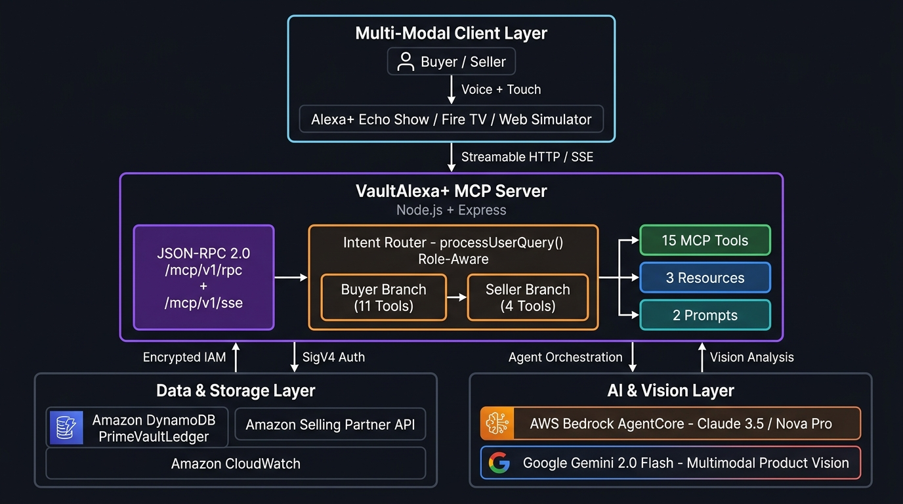
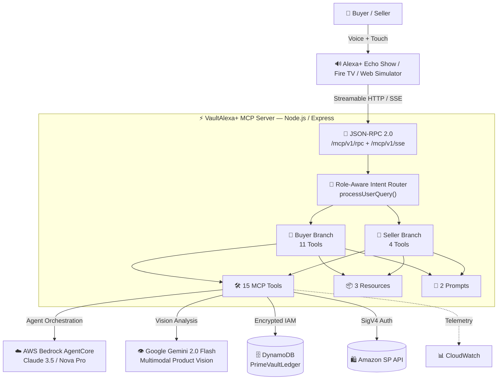

# VaultAlexa+ — Alexa+ Smart Personal Financial & Intelligent Shopping Agent

<div align="center">

[](https://amazonappdev2026.devpost.com/)
[](https://amazonappdev2026.devpost.com/)
[](https://modelcontextprotocol.io/)
[](https://www.jsonrpc.org/)
[](LICENSE)
[](package.json)

**Enterprise-grade autonomous AI financial advisor and intelligent Amazon shopping assistant** — powered by Model Context Protocol (MCP) Spec `2025-11-25` over JSON-RPC 2.0 Streamable HTTP.

[🚀 Quickstart](#-quickstart) · [🛠️ MCP Tools Reference](#️-mcp-tools-reference-15-tools) · [🧪 Testing Guide for Judges](#-testing-guide-for-judges) · [🏗️ Architecture](#️-architecture) · [📜 Friction Log](FRICTION_LOG.md)

</div>

---

## 📌 Overview

**VaultAlexa+** is a **Two-Sided Bilateral AI Agent** bridging **Consumers (Buyers)** with the **Amazon Seller Ecosystem**:

| 🛒 For **Buyers** | 🏪 For **Sellers** |
|---|---|
| Pre-purchase safety validation against monthly budgets | FBA inventory stockout prediction & PO drafting |
| Proactive deficit risk forecast (upcoming bills radar) | Real-time sales analytics & revenue intelligence |
| 1-Click Alexa+ Voice Purchasing with budget guards | Dynamic repricing strategy & Buy Box optimization |
| Bilateral AI negotiation for instant discount vouchers | AI-powered product listing generation from photos |
| Anti-impulse cooldown & opportunity cost simulation | Incoming orders dispatch monitoring |
| Household bill splitting via Alexa Contacts | Multimodal product catalog publishing |
| Price drop sniper & deal watchlist | — |

---

## 📸 Screenshots

| 📊 Financial Dashboard & Alexa+ Chat | 🛍️ Intelligent Amazon Shopping Assistant |
|:---:|:---:|
|  |  |

| 🔌 Interactive MCP Protocol Inspector | 🤝 AI Negotiation & Anti-Impulse Guard |
|:---:|:---:|
|  |  |


---

## 🌟 Key Highlights

- **15 MCP Tools** (far exceeding the minimum 5 required)
- **3 MCP Resources** (`vault://` URI scheme)
- **2 Reusable Prompts** (financial audit, deal negotiation)
- **Full Bilingual** — EN (`US`) and Bahasa Indonesia (`ID`) with dynamic switching
- **Visual Reasoning Trace** — real-time agentic chain-of-thought visible to judges
- **Human-in-the-Loop** — Seller can review, edit, and approve AI-generated product listings before publishing
- **Multimodal AI Vision** — Gemini 2.0 Flash analyzes uploaded product photos to generate Amazon listings

---

## 🚀 Quickstart

### Option A — Zero Dependency: Open in Browser Directly

No installation needed. Open the web simulator instantly:

```bash
# Windows
start index.html

# macOS / Linux
open index.html
```

### Option B — Run MCP Node.js Server (for Judge MCP Inspector)

```bash
# 1. Clone repository
git clone https://github.com/karyalangitdigital/vault-alexa-mcp.git
cd vault-alexa-mcp

# 2. Install dependencies
npm install

# 3. Start MCP server
npm start
# Server is now running at http://localhost:3000

# 4. Open web simulator
#    Navigate browser to: http://localhost:3000
```

> **MCP Endpoints:**
> - JSON-RPC 2.0: `POST http://localhost:3000/mcp/v1/rpc`
> - Server-Sent Events: `GET http://localhost:3000/mcp/v1/sse`
> - Health Check: `GET http://localhost:3000/health`

### Option C — Run Tests (for Judge Verification)

```bash
npm test           # MCP JSON-RPC 2.0 compliance test (9 methods)
npm run test:dom   # DOM sync & state consistency test
npm run test:all   # Full test suite
```

---

## 🛠️ MCP Tools Reference (15 Tools)

All tools conform to **MCP Specification 2025-11-25** and are callable via `tools/call` JSON-RPC 2.0.

### 🛒 Buyer Tools

| # | Tool Name | Description | Key Args |
|---|---|---|---|
| 1 | `get_financial_summary` | Real-time budget status, account balances & category breakdown | `timeframe` |
| 2 | `search_amazon_deals` | Intelligent Amazon Prime deal discovery with sorting & filters | `category`, `keyword`, `maxPrice`, `sortBy` |
| 3 | `validate_purchase_safety` | Pre-purchase safety check against remaining category budget | `itemName`*, `itemPrice`*, `category`* |
| 4 | `track_price_drop_target` | Register deal sniper / price drop alert watchdog | `itemName`*, `targetPrice`* |
| 5 | `split_shared_expense` | Split household expenses via Alexa Contacts | `totalAmount`*, `title`*, `splitMembers` |
| 6 | `log_transaction` | Append a financial transaction to the personal vault ledger | `title`*, `amount`*, `category`* |
| 7 | `negotiate_dynamic_discount` | Bilateral buyer-seller real-time discount negotiation bridge | `itemName`*, `currentPrice`* |
| 8 | `calculate_opportunity_cost` | Anti-impulse guard: projects savings goal delay from purchase | `itemName`*, `itemPrice`* |
| 9 | `predict_monthly_runway` | Proactive deficit risk forecast using upcoming obligation radar | `projectedSpend` |
| 10 | `initiate_purchase_dispute` | Full-lifecycle RMA dispute, return label & instant escrow refund | `orderId`*, `reason`* |
| 11 | `trigger_peer_split_request` | Dispatch Alexa voice bill-split notifications to household contacts | `total`*, `contacts` |

### 🏪 Seller Tools

| # | Tool Name | Description | Key Args |
|---|---|---|---|
| 12 | `generate_morning_briefing` | Proactive standup: cashflow / FBA stockout / orders (role-aware) | `includeWatchlistRadar` |
| 13 | `predict_inventory_stockout` | FBA burn velocity analysis, auto PO draft & dynamic repricing | `asin`*, `dailyVelocity` |
| 14 | `analyze_product_image_listing` | Gemini 2.0 Flash multimodal vision → Amazon-ready product listing | `imageDataUrl`*, `hintProductName` |
| 15 | `publish_seller_product` | Confirm & publish AI-generated listing to seller catalog | `listingData`* |

*\* = required argument*

### 📦 MCP Resources (3)

| URI | Description |
|---|---|
| `vault://financial/overview` | Personal financial vault: balances, categories, transactions |
| `vault://household/summary` | Household shared pool, member limits, pending splits |
| `vault://diagnostics/health` | MCP server health, latency metrics, RPC audit trails |

### 📝 MCP Prompts (2)

| Name | Description |
|---|---|
| `financial_health_audit` | Deep financial audit prompt with savings goal integration |
| `amazon_deal_negotiator` | Bilateral negotiation prompt for Buyer-Seller discount bridge |

---

## 🧪 Testing Guide for Judges

### Quick JSON-RPC Test (curl)

```bash
# List all 15 tools
curl -X POST http://localhost:3000/mcp/v1/rpc \
  -H "Content-Type: application/json" \
  -d '{"jsonrpc":"2.0","id":1,"method":"tools/list","params":{}}'

# Call validate_purchase_safety
curl -X POST http://localhost:3000/mcp/v1/rpc \
  -H "Content-Type: application/json" \
  -d '{"jsonrpc":"2.0","id":2,"method":"tools/call","params":{"name":"validate_purchase_safety","arguments":{"itemName":"Bose Headphones 700","itemPrice":219.00,"category":"shopping"}}}'

# Read financial vault resource
curl -X POST http://localhost:3000/mcp/v1/rpc \
  -H "Content-Type: application/json" \
  -d '{"jsonrpc":"2.0","id":3,"method":"resources/read","params":{"uri":"vault://financial/overview"}}'
```

### Web Simulator — 7 Demo Scenarios

Launch `index.html` (or `http://localhost:3000`) and type these into the Alexa+ chat:

| # | Type This | Tool Invoked | What to Observe |
|---|---|---|---|
| 1 | `morning briefing` | `generate_morning_briefing` | **Buyer mode**: personal standup (cashflow/bills/sniper radar) · **Seller mode**: store ops briefing (revenue/stockout/orders) |
| 2 | `prediksi defisit tagihan rutin` | `predict_monthly_runway` | Multi-agent swarm warns of $450 upcoming obligations causing -$129 deficit |
| 3 | `Bose Headphones rusak di jalan` | `initiate_purchase_dispute` | RMA ticket issued, prepaid return label, +$219 instant escrow credit |
| 4 | `tawar harga echo show` | `negotiate_dynamic_discount` | Bilateral negotiation issues voucher `AMZ-MCP-SAVE15` ($99.99 → $84.99) |
| 5 | `bagi tagihan ke Michael` | `trigger_peer_split_request` | Voice bill-split dispatched to Echo Dot of household members |
| 6 | `cek kehabisan stok fba` | `predict_inventory_stockout` | FBA co-pilot flags 3.3-day stockout, drafts PO-SUPPLIER-77491 |
| 7 | Switch to **Seller Mode** → `morning briefing` | `generate_morning_briefing` | Role-aware: shows Apex Tech Store operations briefing, not Buyer data |

### MCP Inspector Tab (Built-in)

1. Click **"MCP Inspector"** in the left sidebar
2. Select any of the **15 registered tools** from the dropdown
3. Click **"Execute JSON-RPC Tool"**
4. Observe structured JSON response with sub-15ms latency indicator

### Bilingual Test

Click the **`ID` / `US`** toggle in the top-right header to instantly switch all UI labels, voice synthesis accent, and agent reasoning trace language.

---

## 🏗️ Architecture






### Role-Aware Dual-Agent Flow

```
User Query
    │
    ▼
processUserQuery()
    │
    ├─[window.currentUserRole === 'seller']──► Seller Intent Chain
    │   ├── generate_morning_briefing (Store Ops Briefing)
    │   ├── predict_inventory_stockout (FBA Co-Pilot)
    │   ├── analyze_product_image_listing (Multimodal Vision)
    │   └── publish_seller_product (Human-in-the-Loop Confirm)
    │
    └─[window.currentUserRole === 'buyer']───► Buyer Intent Chain
        ├── validate_purchase_safety (Budget Guard)
        ├── predict_monthly_runway (Deficit Forecast)
        ├── negotiate_dynamic_discount (Bilateral Negotiation)
        ├── initiate_purchase_dispute (RMA & Refund)
        └── generate_morning_briefing (Personal Finance Standup)
```

---

## 📁 Project Structure

```
vault-alexa-mcp/
├── index.html              # Web simulator UI (Single-Page App)
├── app.js                  # Frontend controller & agent intent router
├── styles.css              # Premium glassmorphism UI design system
├── mcp-server.js           # MCP Server (Express / JSON-RPC 2.0 / SSE)
├── mcp-config.json         # MCP manifest (Spec 2025-11-25, Streamable HTTP)
├── package.json            # npm config — version 2.5.0
├── test-mcp.js             # MCP JSON-RPC compliance test (9 methods)
├── test-dom-and-sync.js    # DOM state sync test
├── test-e2e-dom.js         # End-to-end role-switching E2E test
├── FRICTION_LOG.md         # Hackathon bonus: developer friction feedback
├── LICENSE                 # MIT License
└── docs/
    ├── Naskah_Video_Demo_VaultAlexa.html
    └── Panduan_Submisi_Hackathon_VaultAlexa.html
```

---

## 🧪 Running the Full Test Suite

```bash
# MCP Protocol Compliance (9 JSON-RPC methods verified)
npm test

# DOM Sync & State Consistency
npm run test:dom

# Full Suite
npm run test:all
```

Expected output: `✅ All MCP tests passed — 9/9 JSON-RPC 2.0 methods verified`

---

## ☁️ AWS Services

| Service | Role in VaultAlexa+ |
|---|---|
| **Amazon API Gateway** | TLS 1.3 ingress for Streamable HTTP / SSE |
| **AWS Lambda / ECS Fargate** | Hosts stateless MCP server (sub-15ms) |
| **AWS Bedrock AgentCore** | Multi-agent orchestration (Claude 3.5 / Nova Pro) |
| **Amazon DynamoDB** | Encrypted personal financial vault ledger |
| **Amazon Selling Partner API** | Live Prime catalog & seller fulfillment |
| **Amazon CloudWatch** | RPC latency telemetry & audit trails |

---

## 🏆 Hackathon Compliance Summary

| Requirement | Status |
|---|---|
| MCP Spec `2025-11-25` | ✅ |
| Transport: Streamable HTTP + SSE | ✅ |
| JSON-RPC 2.0 (`tools/list`, `tools/call`, `resources/read`, `prompts/list`) | ✅ |
| Minimum 5 agentic tools | ✅ **15 tools** |
| Human-in-the-Loop safety guardrails | ✅ `validate_purchase_safety` + Anti-Impulse Lock + Listing Review |
| Proactive agent (not just reactive) | ✅ `generate_morning_briefing` |
| Developer Friction Log (Bonus 10%) | ✅ [FRICTION_LOG.md](FRICTION_LOG.md) |
| Open Source MIT License | ✅ |
| Working demo / test scripts | ✅ `npm test` |

---

## 👤 Author

**KARYA LANGIT Digital — Supriadi**  
Amazon Developer Hackathon 2026 · Alexa+ MCP Server Track  
📧 [karyalangitdigital](https://github.com/karyalangitdigital)

---

## 📜 License

Distributed under the **MIT License**. See [LICENSE](LICENSE) for details.
