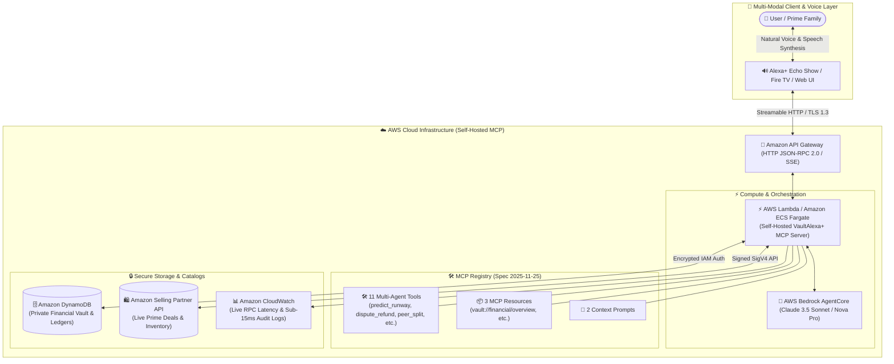

# VaultAlexa+ - Alexa+ Autonomous AI Financial Agent & Amazon Shopping Assistant

[](https://amazonappdev2026.devpost.com/)
[](https://amazonappdev2026.devpost.com/)
[](https://modelcontextprotocol.io/)
[](LICENSE)

---

## 📌 Overview

**VaultAlexa+** is an enterprise-grade autonomous AI financial advisor and intelligent Amazon shopping assistant designed for the **Alexa+** ecosystem. It is powered by the **Model Context Protocol (MCP)** specification (version `2025-11-25`) over JSON-RPC 2.0.

It acts as a **Two-Sided Bridge (Bilateral Protocol)** connecting **Consumers (Buyers)** with the **Amazon Seller Ecosystem**:
- **For Buyers**: Safeguards monthly budgets with real-time pre-purchase safety checks, automated deal sniping, and transparent household shared expense splitting.
- **For Sellers**: Boosts conversion rates and eliminates cart abandonment through frictionless Alexa+ 1-Click Voice Purchasing, targeted discount matching, and AI-driven sales growth advisory.

---

## 📸 Screenshots & UI Showcase

| 📊 Financial Dashboard & Alexa+ Chat | 🛍️ Intelligent Amazon Shopping Assistant |
| :---: | :---: |
|  |  |

| 🔌 Interactive MCP Protocol Inspector | 🤝 AI Negotiation & Anti-Impulse Guard |
| :---: | :---: |
|  |  |

---

## 🌟 Key Features (11 Enterprise Multi-Agent Tools)

1. **🔮 Proactive Budget Runway & Deficit Risk Forecast (`predict_monthly_runway`)**: Machine Learning forecasting (Amazon Forecast / Bedrock) that detects upcoming recurring utility & insurance obligations ($450) to prevent month-end cashflow deficit before discretionary checkouts.
2. **🛡️ Autonomous Safe-to-Spend Validator (`validate_purchase_safety`)**: Pre-validates prospective purchase costs against remaining monthly category allowances to prevent impulsive overspending.
3. **🤝 Bilateral Dynamic Discount Negotiation (`negotiate_dynamic_discount`)**: Real-time automated negotiation bridge connecting Buyer safe-budget limits with Amazon Seller API to unlock instant 1-Click volume vouchers.
4. **🚨 Impulse Buying Cool-Down & Opportunity Cost (`calculate_opportunity_cost`)**: Projects the delay in savings goals (e.g. 32 days of Tokyo vacation funds) and triggers a 24-hour reflection reminder.
5. **🎫 Full Lifecycle Post-Purchase Dispute & Refund Agent (`initiate_purchase_dispute`)**: Auto-generates Amazon RMA tickets, issues prepaid carrier return QR codes, and queues instant escrow refunds for defective deliveries.
6. **👥 Smart Community Social Bill Split (`trigger_peer_split_request`)**: Dispatches automated Alexa voice bill-split requests across Alexa Household Contacts with real-time settlement tracking.
7. **🎯 Price Drop Sniper (`track_price_drop_target`)**: Monitors Amazon item discounts and dispatches alerts when target price thresholds are reached.
8. **📊 Real-time Financial Overview (`get_financial_summary`)**: Delivers accurate calculations of balances, spending rates, and budget health.
9. **🛍️ Intelligent Prime Deal Discovery (`search_amazon_deals`)**: Fetches verified Amazon Prime discounts tailored to current spending capacity.
10. **⚡ Interactive MCP Developer Inspector**: Built-in visual playground allowing judges and developers to test live JSON-RPC 2.0 requests across all 11 tools with sub-15ms response latency.
11. **🌐 Full Bilingual Support (ID / US)**: Complete instant toggle between Bahasa Indonesia (`ID`) and English (`US`) across all UI elements, voice speech synthesis, and reasoning traces.

---

## 🏗️ Cloud & Serverless Architecture (AWS Powered)



### ☁️ AWS Services Deployed:
- **Amazon API Gateway**: Exposes low-latency HTTP endpoints over TLS 1.3 for bidirectional JSON-RPC 2.0 requests.
- **AWS Lambda / Amazon ECS Fargate**: Hosts the stateless, ultra-fast MCP server logic with sub-15ms execution time.
- **AWS Bedrock (Claude 3.5 / Amazon Nova)**: Powers multi-turn autonomous agent reasoning and dynamic tool selection.
- **Amazon DynamoDB**: Stores personal financial vault data, encrypted ledger balances, and household split pools.
- **Amazon CloudWatch**: Telemetry monitoring for tool invocation latency and protocol audit trails.

---

## 🛠️ Quickstart (Zero Dependencies Required for Web Demo)

### 1. Launch the Web Simulator
Simply open `index.html` in Microsoft Edge, Google Chrome, or any modern web browser:
```bash
# Open in browser directly
file:///path-to/vault-alexa-mcp/index.html
```

### 2. Optional: Run Standalone MCP Node.js Server
```bash
npm install
npm start
# Server listens on http://localhost:3000/mcp/v1/rpc
```

---

## 🧪 Testing Guide for Judges (Multi-Agent Live Triggers)

1. **Test Proactive Deficit Risk & Forecast (`predict_monthly_runway`)**:
   - Ask: *"Apakah aman beli headphone atau ada prediksi defisit tagihan rutin?"*
   - Observe: Multi-Agent Swarm engages and warns of $450 upcoming bills due in 5-7 days.
2. **Test Post-Purchase Dispute & Refund (`initiate_purchase_dispute`)**:
   - Ask: *"Barang Bose Headphones saya rusak di jalan, tolong ajukan komplain dan refund"*
   - Observe: AI issues RMA Ticket, pre-paid return label, and instant $219.00 escrow credit.
3. **Test Smart Community Voice Split (`trigger_peer_split_request`)**:
   - Ask: *"Kirim notifikasi bagi tagihan langganan keluarga ke kontak Michael dan David"*
   - Observe: Dispatches voice invoice alerts across Alexa household devices.
4. **Test Dynamic Discount Negotiation (`negotiate_dynamic_discount`)**:
   - Ask: *"Tawar harga untuk speaker Echo Show dong"*
   - Observe: Bilateral MCP negotiation issues voucher `AMZ-MCP-SAVE15` ($99.99 ➔ $84.99).
5. **Test Safe-to-Spend 1-Click Purchase & Rebalance**:
   - Ask: *"Beli Bose Headphones"* ➔ Click **`+ Transfer $250 dari Tabungan`** to observe live budget rebalancing.
6. **Test MCP Developer Inspector**:
   - Navigate to the **"Inspektur MCP"** tab in the sidebar.
   - Select any of the **11 registered tools**, click **"Execute JSON-RPC Tool"**, and observe structured JSON response (<15ms latency).
7. **Test Bilingual Switcher**:
   - Click the **`ID` / `US`** button in the top-right header to dynamically toggle UI language, voice accents, and reasoning traces.

---

## 🚀 Future Roadmap & Next-Gen MCP Capabilities

1. **🤖 Autonomous Deal Negotiation Protocol (`negotiate_dynamic_discount`)**:
   - Multi-agent negotiation bridge between Buyer and Seller MCP servers to unlock tailored bundle vouchers and dynamic volume discounts.
2. **🧾 Instant Receipt & Offline Expense OCR (`parse_receipt_data`)**:
   - Automated invoice scanning and tax itemization to log offline retail transactions directly into the private financial vault.
3. **🚨 Impulse Buying Cool-Down & Opportunity Cost Simulator (`calculate_opportunity_cost`)**:
   - Behavioral AI guardrails that simulate the long-term impact on savings goals before purchasing discretionary luxury items.
4. **📦 Multi-Store Basket Arbitrage & Unit-Price Optimizer (`find_unit_price_arbitrage`)**:
   - Real-time price-per-unit comparisons across Amazon Prime sizes to maximize household savings.
5. **📊 Interactive Voice-Driven Stress-Test Simulator (`simulate_financial_stress_test`)**:
   - On-demand "What-If" voice simulations to model income fluctuations or unexpected emergency expenses.

---

## 📜 Bonus Point Claims & Friction Log

- **10% Bonus Point Claim**: Comprehensive developer feedback report in [`FRICTION_LOG.md`](file:///C:/Users/karya/.gemini/antigravity-ide/scratch/vault-alexa-mcp/FRICTION_LOG.md).
- **Open Source**: Distributed under the **MIT License**.

